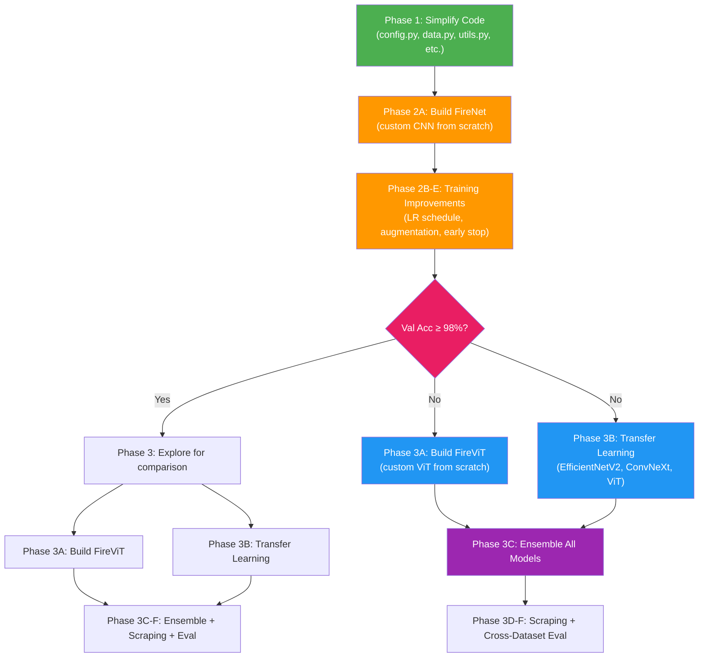

# Wildfire Detection: Achieving >98% Accuracy

## Background & Current State

### Dataset
| Split | Positive (fire/smoke) | Negative | Total | Imbalance Ratio |
|-------|----------------------|----------|-------|-----------------|
| Train | 3,615 | 1,546 | 5,161 | 2.34:1 |
| Valid | 890 | 367 | 1,257 | 2.43:1 |
| Test  | 388 | 294 | 682 | 1.32:1 |

- All images are 256×256 RGB JPEGs
- Sources: boreal drone imagery + Roboflow datasets
- Classes: `negative`, `positive` (binary)

### Current Model Performance
| Metric | Train | Val | Test |
|--------|-------|-----|------|
| Accuracy | ~90.8% | ~95.0% | ~94.1% |
| Loss | 0.250 | 0.174 | 0.179 |

### Issues with Current Architecture (`SimpleCNN`)
1. **Non-standard kernel sizes** (2×2 kernels in early layers) — loses spatial information
2. **Stride-1 max pooling** in first two layers — barely reduces spatial dims, wastes compute
3. **Over-parameterized classifier head** (4 FC layers with 3 dropout layers) — excessive regularization
4. **No pretrained features** — training from scratch on ~5K images is inherently limited
5. **Class imbalance** — 2.3:1 ratio with no compensation
6. **High learning rate** (5e-3) with no scheduling — likely overshooting optima
7. **No residual connections** — gradient flow degrades with depth
8. **No channel attention** — all features treated equally regardless of relevance

---

## Phase 1: Simplify the Codebase

> [!IMPORTANT]
> All simplifications preserve functionality. The goal is readability and a clean foundation for Phases 2 & 3.

### File Structure After Phase 1

```
Final/
├── config.py          # [NEW] All constants/hyperparameters
├── data.py            # [NEW] Dataset loading, transforms, dataloaders
├── models.py          # [MODIFY] Simplified CNN + new model factories
├── train.py           # [MODIFY] Simplified training loop
├── evaluate.py        # [NEW] Standalone evaluation/prediction script
└── utils.py           # [NEW] Metrics, logging, device selection
```

#### [NEW] [config.py](file:///Users/filipr/Library/CloudStorage/OneDrive-DavidsonAcademy/STAT%20760%20-%20Rojas/Final/config.py)
All hyperparameters as module-level constants:
```python
DATA_ROOT = "./dataset/combined_smoke_fire_classification_256_balanced"
SAVE_PATH = "./cnn_best.pt"
EPOCHS = 30
BATCH_SIZE = 32
LR = 1e-3
WEIGHT_DECAY = 1e-2
DROPOUT = 0.3
IMAGE_SIZE = 224
NUM_WORKERS = 4
MEAN = [0.485, 0.456, 0.406]
STD = [0.229, 0.224, 0.225]
```

#### [NEW] [data.py](file:///Users/filipr/Library/CloudStorage/OneDrive-DavidsonAcademy/STAT%20760%20-%20Rojas/Final/data.py)
- `get_transforms(image_size, mean, std, is_train)` — returns appropriate transform pipeline
- `get_dataloaders(data_root, image_size, batch_size, num_workers)` — returns train/val/test loaders
- Remove `compute_train_mean_std` (use ImageNet stats)
- Remove `ImagePathDataset` and `list_image_paths` (move to `evaluate.py` if needed)

#### [NEW] [utils.py](file:///Users/filipr/Library/CloudStorage/OneDrive-DavidsonAcademy/STAT%20760%20-%20Rojas/Final/utils.py)
- `get_device()` — one-liner
- `Metrics` dataclass (kept)
- Logging / print helpers

#### [MODIFY] [train.py](file:///Users/filipr/Library/CloudStorage/OneDrive-DavidsonAcademy/STAT%20760%20-%20Rojas/Final/train.py)
- Remove `argparse` entirely — import from `config.py`
- Remove `set_seed`, `seed_worker`, `get_device` — move to `utils.py` or inline
- Remove `predict_images`, `list_image_paths`, `build_transforms`, `compute_train_mean_std`
- Simplify `main()` to ~50 lines: load data → build model → train → evaluate → save
- Single `run_epoch()` stays but is cleaned up

#### [MODIFY] [models.py](file:///Users/filipr/Library/CloudStorage/OneDrive-DavidsonAcademy/STAT%20760%20-%20Rojas/Final/models.py)
- Keep `SimpleCNN` but fix architecture (proper kernel sizes, proper pooling strides)
- Add factory function `build_model(name, num_classes)` for Phase 2/3 models

---

## Phase 2: Custom CNN Built From Scratch

> [!IMPORTANT]
> This is a **from-scratch** architecture — no pretrained weights, no `timm`. Every layer is designed and trained by us.

### 2A. Architecture: "FireNet" — A Modern Custom CNN

The design draws inspiration from ConvNeXt and SE-ResNet, incorporating the following modern principles:

#### Building Blocks

**1. Squeeze-and-Excitation (SE) Block** — learns to re-weight channels based on importance:
```python
class SEBlock(nn.Module):
    """Channel attention: learn which feature channels matter most"""
    def __init__(self, channels, reduction=16):
        self.squeeze = nn.AdaptiveAvgPool2d(1)       # Global info
        self.excitation = nn.Sequential(
            nn.Linear(channels, channels // reduction),
            nn.GELU(),
            nn.Linear(channels // reduction, channels),
            nn.Sigmoid()
        )
```

**2. Residual Block with SE Attention** — skip connections + channel attention:
```python
class ResidualSEBlock(nn.Module):
    """Conv → BN → GELU → Conv → BN → SE → + skip → GELU"""
    def __init__(self, in_ch, out_ch, stride=1):
        self.conv1 = nn.Conv2d(in_ch, out_ch, 3, stride, padding=1, bias=False)
        self.bn1   = nn.BatchNorm2d(out_ch)
        self.conv2 = nn.Conv2d(out_ch, out_ch, 3, 1, padding=1, bias=False)
        self.bn2   = nn.BatchNorm2d(out_ch)
        self.se    = SEBlock(out_ch)
        self.shortcut = ...  # 1x1 conv if dims change, else identity
```

**3. Optional: Depthwise Separable Convolution variant** — for efficiency:
```python
class DepthwiseSeparableConv(nn.Module):
    """Depthwise (spatial) + Pointwise (channel mixing) — fewer params"""
    def __init__(self, in_ch, out_ch, kernel_size=3, stride=1):
        self.depthwise = nn.Conv2d(in_ch, in_ch, kernel_size, stride, 
                                    padding=kernel_size//2, groups=in_ch)
        self.pointwise = nn.Conv2d(in_ch, out_ch, 1)
```

#### Full Architecture

```
Input (3 × 224 × 224)
│
├─ Stem: Conv2d(3→64, 4×4, stride=4) + LayerNorm    # Patchify stem (ConvNeXt-style)
│        Output: 64 × 56 × 56
│
├─ Stage 1: 2× ResidualSEBlock(64→64)
│        Output: 64 × 56 × 56
│
├─ Stage 2: 2× ResidualSEBlock(64→128, stride=2 on first)
│        Output: 128 × 28 × 28
│
├─ Stage 3: 4× ResidualSEBlock(128→256, stride=2 on first)
│        Output: 256 × 14 × 14
│
├─ Stage 4: 2× ResidualSEBlock(256→512, stride=2 on first)
│        Output: 512 × 7 × 7
│
├─ Global Average Pool → 512
│
├─ Classifier: Linear(512→256) → GELU → Dropout(0.3)
│              Linear(256→2)
│
Output: 2 logits (negative, positive)
```

**Estimated Parameters:** ~8-10M (much smaller than ResNet-50's 25M but large enough to learn complex features)

#### Why This Architecture Should Work

| Design Choice | Rationale |
|--------------|-----------|
| **Patchify stem (4×4 stride-4)** | Aggressively reduces spatial dims early — ConvNeXt showed this outperforms the traditional 7×7+maxpool stem |
| **Residual connections** | Enable gradient flow through 10 conv layers without vanishing gradients |
| **SE attention** | Let the network learn that "red/orange channels" and "haze/smoke features" are important for fire detection |
| **GELU activation** | Smoother than ReLU, better optimization landscape — used in all modern architectures |
| **BatchNorm** | Stabilizes training on small datasets better than LayerNorm for CNNs |
| **Stage ratio [2,2,4,2]** | Puts most capacity in stage 3 (14×14), which is where mid-level features like smoke patterns and flame shapes are extracted |
| **Simple classifier head** | Just one hidden layer — avoids over-regularization of the original 4-layer head |
| **Stochastic depth (optional)** | Randomly skips residual blocks during training — strong regularizer |

### 2B. Training Improvements

| Technique | Current | Proposed | Impact |
|-----------|---------|----------|--------|
| **Optimizer** | AdamW, lr=5e-3 | AdamW, lr=1e-3 | Prevents overshooting |
| **LR Schedule** | None | CosineAnnealingWarmRestarts (T_0=5) | Better convergence |
| **Warmup** | None | Linear warmup for 3 epochs | Stabilizes early training |
| **Loss** | CrossEntropyLoss | CrossEntropyLoss + label smoothing (0.1) | Reduces overconfidence |
| **Batch Size** | 16 | 32 | Smoother gradients |
| **Epochs** | 16 | 40-50 (with early stopping, patience=8) | Find true optimum |
| **Gradient Clipping** | None | max_norm=1.0 | Prevents exploding gradients |
| **Class Weights** | None | Weighted CE based on class frequency (~[1.0, 0.43]) | Handles 2.3:1 imbalance |
| **Weight Decay** | 1e-4 | 1e-2 | Stronger regularization |

### 2C. Data Augmentation

**Current augmentations** (weak):
- RandomResizedCrop (scale 0.75–1.0)
- RandomHorizontalFlip
- ColorJitter (mild)

**Proposed augmentations** (strong):
```python
train_tf = v2.Compose([
    v2.ToImage(),
    v2.RandomResizedCrop(size=(IMAGE_SIZE, IMAGE_SIZE), scale=(0.5, 1.0)),
    v2.RandomHorizontalFlip(p=0.5),
    v2.RandomVerticalFlip(p=0.2),
    v2.RandomRotation(degrees=15),
    v2.ColorJitter(brightness=0.3, contrast=0.3, saturation=0.2, hue=0.05),
    v2.RandomGrayscale(p=0.05),
    v2.RandomErasing(p=0.2),        # Simulates occlusion
    v2.ToDtype(torch.float32, scale=True),
    v2.Normalize(mean=MEAN, std=STD),
])
```

**Advanced augmentations (optional, high impact):**
- **Mixup** (α=0.2): Linearly interpolates image pairs and labels
- **CutMix** (α=1.0): Cuts/pastes patches between images

### 2D. Test-Time Augmentation (TTA)

At inference, create multiple augmented versions of each image (flips, crops), average predictions. Typically adds +0.5-1.0% for free.

### 2E. Early Stopping

Monitor val loss with patience=8 to avoid overfitting and save the best model.

### Expected Results for Phase 2
- **Val accuracy:** 96-98% (from 95%)
- **Test accuracy:** 95-97% (from 94%)
- The biggest gains come from: residual connections, SE attention, proper LR schedule, stronger augmentation

---

## Phase 3: Alternative Architectures, Transfer Learning & More Data

### 3A. Custom Vision Transformer (ViT) — Built From Scratch

#### Architecture: "FireViT"

We build a **ViT-Tiny** sized model from scratch:

```
Input (3 × 224 × 224)
│
├─ Patch Embedding: Conv2d(3→384, 16×16, stride=16) → 196 patches of dim 384
│
├─ Prepend [CLS] token (learnable, dim 384)
│
├─ Add learnable positional embeddings (197 × 384)
│
├─ Dropout(0.1)
│
├─ 6× Transformer Encoder Block:
│   ├─ LayerNorm → Multi-Head Self-Attention (6 heads, dim 384)
│   │              + Dropout(0.1) + Stochastic Depth
│   ├─ Residual connection
│   ├─ LayerNorm → MLP(384→1536→384, GELU) + Dropout(0.1)
│   └─ Residual connection
│
├─ LayerNorm
│
├─ Extract [CLS] token → 384-dim vector
│
├─ Classification Head: Linear(384→2)
│
Output: 2 logits
```

**Key design decisions:**
| Parameter | Value | Rationale |
|-----------|-------|-----------|
| Embed dim | 384 | ViT-Small size — large enough to learn, small enough not to overfit on 5K images |
| Depth | 6 | Shallower than ViT-Base (12) to avoid overfitting |
| Heads | 6 | 384/6 = 64 dim per head |
| Patch size | 16 | Standard; 224/16 = 14×14 = 196 patches |
| MLP ratio | 4× | Standard expansion (384→1536) |
| Stochastic depth | 0.1 | Linearly increasing drop rate across layers |
| Dropout | 0.1 | Applied to attention and MLP |
| Weight decay | 0.05 | Higher than CNN — ViTs benefit from stronger regularization |

**Training specifics for ViT from scratch:**
- **Much longer training:** 100-150 epochs (ViTs converge slower without pretraining)
- **Strong augmentation mandatory:** RandAugment + Mixup + CutMix
- **Warmup:** 10 epochs linear warmup
- **LR:** 5e-4 with cosine decay to 1e-6
- **Expected accuracy:** 90-94% (ViTs struggle on <10K images without pretraining)

> [!NOTE]
> The custom ViT trained from scratch will likely underperform the custom CNN on this small dataset. That's expected — ViTs lack inductive biases (translation invariance, locality) that help CNNs on small data. The point is to demonstrate the architecture and compare.

### 3B. Transfer Learning — Pretrained Models via `timm`

> [!IMPORTANT]
> Requires installing `timm`: `pip install timm`

#### 3B-i. Fine-tuned EfficientNetV2-S
```python
import timm
model = timm.create_model('tf_efficientnetv2_s', pretrained=True, num_classes=2)
```
- **Progressive unfreezing:** Freeze backbone for 5 epochs (train head only), then unfreeze all with low LR (1e-5)
- **Expected accuracy:** 97-99%

#### 3B-ii. Fine-tuned ConvNeXt-Tiny
```python
model = timm.create_model('convnext_tiny', pretrained=True, num_classes=2)
```
- Same unfreezing strategy
- **Expected accuracy:** 97-99%

#### 3B-iii. Fine-tuned ViT-Base (pretrained)
```python
model = timm.create_model('vit_base_patch16_224', pretrained=True, num_classes=2)
```
- Lower LR (5e-5), strong weight decay (0.05)
- **Expected accuracy:** 97-98%

### 3C. Ensemble Methods

Combine predictions from the best models for maximum accuracy:

```python
# Soft voting (average probabilities)
p_cnn   = softmax(firenet(image))
p_vit   = softmax(firevit(image))
p_effnet = softmax(efficientnet(image))

final = 0.4 * p_effnet + 0.35 * p_cnn + 0.25 * p_vit
prediction = argmax(final)
```

- **Soft voting** (average probabilities) is simplest and usually best
- **Learned weights** via a small meta-classifier on held-out val set
- Expected improvement: +0.5-1.5% over best single model

### 3D. Segmentation-Guided Classification

Use SAM (Segment Anything Model) or color-space heuristics to extract semantic features:

1. **HSV color-space features** (simple, no extra model needed):
   - Flame detection: high Hue in red/orange range, high Saturation
   - Smoke detection: low Saturation, mid-range Value (gray haze)
   - Compute % of image pixels matching flame/smoke thresholds
   - Feed these as auxiliary scalar features to the classifier

2. **SAM-based segmentation** (more complex):
   - Run SAM zero-shot on images → segment into regions
   - Use region statistics (area, color, texture) as extra features
   - Could add segmentation masks as extra input channels (4-5 channels)

### 3E. Web Scraping for Additional Data

#### [NEW] [scraper.py](file:///Users/filipr/Library/CloudStorage/OneDrive-DavidsonAcademy/STAT%20760%20-%20Rojas/Final/scraper.py)

Using `icrawler` (Bing) and/or `duckduckgo_search`:

**Search queries for positive class:**
- `"wildfire aerial view"`, `"forest fire smoke"`, `"wildfire drone photo"`
- `"bushfire Australia"`, `"California wildfire"`, `"prescribed burn smoke"`
- `"desert wildfire"`, `"grassland fire"`

**Search queries for negative class (including hard negatives):**
- `"forest aerial photo"`, `"desert landscape"`
- `"mountain landscape clear sky"`, `"boreal forest"`
- `"sunset clouds nature"` (hard negative — orange sky without fire)
- `"fog morning forest"` (hard negative — looks like smoke)

**Pipeline:**
1. Scrape ~500-1000 images per query
2. Resize all to 256×256
3. Run existing model for auto-labeling
4. Manual review of edge cases
5. Add to training set

**Public datasets to download:**
- [The Wildfire Dataset (Kaggle)](https://www.kaggle.com/datasets/elmadafri/the-wildfire-dataset) — 2,700 aerial images
- [D-Fire Dataset (Kaggle)](https://www.kaggle.com/datasets/sayedgamal/smoke-fire-detection-yolo) — 21K+ images
- [DeepQuestAI Fire-Flame-Dataset](https://github.com/OlafenwaMoses/FireNET) — classification-ready

### 3F. Cross-Dataset Evaluation

Test all trained models on entirely different wildfire datasets to measure true generalization.

---

## Architecture Comparison Summary

| Model | Type | Pretrained? | Params | Expected Val Acc | Expected Test Acc |
|-------|------|-------------|--------|-----------------|-------------------|
| SimpleCNN (current) | CNN | No | ~3M | 95% | 94% |
| **FireNet** (Phase 2) | Custom CNN | No | ~8-10M | 96-98% | 95-97% |
| **FireViT** (Phase 3A) | Custom ViT | No | ~7M | 90-94% | 88-93% |
| EfficientNetV2-S (Phase 3B) | CNN | Yes (ImageNet) | 21M | 98-99% | 97-99% |
| ConvNeXt-Tiny (Phase 3B) | CNN | Yes (ImageNet) | 28M | 98-99% | 97-99% |
| ViT-Base (Phase 3B) | ViT | Yes (ImageNet) | 86M | 97-98% | 96-98% |
| Ensemble (Phase 3C) | Mixed | Mixed | — | 99%+ | 98%+ |

---

## Open Questions

> [!IMPORTANT]
> 1. **GPU availability**: Are you training on MPS (Mac) only, or do you have access to a CUDA GPU (e.g., Pronghorn HPC)? The custom ViT will need ~100 epochs and the pretrained models benefit from larger batch sizes. MPS will work but be slower.
> 2. **`timm` installation**: Your environment doesn't have `timm`. Should I install it now? (`pip install timm`) — needed only for Phase 3B.
> 3. **Scraper scope**: Should the scraper actually download images, or just prepare the script for manual execution? Some queries return copyrighted images.
> 4. **Keep SimpleCNN?**: Should we keep the original `SimpleCNN` as a baseline reference in `models.py`, or replace it entirely?
> 5. **SAM complexity**: For segmentation-guided features, do you prefer the simple HSV color-space approach, or the full SAM pipeline?

---

## Proposed Execution Order



---

## Verification Plan

### Automated Tests
1. **After Phase 1:** Run `python train.py` — confirm it trains to ~94% val acc (same baseline)
2. **After Phase 2:** Run `python train.py` with FireNet — target ≥97% val acc within 50 epochs
3. **After Phase 3A:** Run ViT training script — document accuracy (likely 90-94%)
4. **After Phase 3B:** Run transfer learning scripts — target ≥98% val/test acc
5. **After Phase 3C:** Run ensemble evaluation — target ≥98% on all splits

### Manual Verification
- Visually inspect augmented images
- Review confusion matrix for systematic errors (sunset clouds → fire, fog → smoke)
- Spot-check scraped images for quality
- Compare attention maps between CNN and ViT to understand what each model looks at
